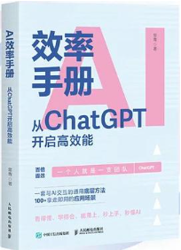
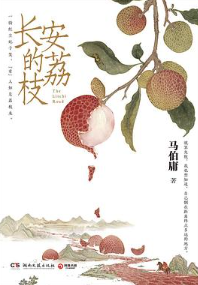

# 读了

### 2026

| 序号 | 图片                               | 书名                              | 开始 | 结束 | 书摘 |
| ---- | ---------------------------------- | --------------------------------- | ---- | ---- | ---- |
| 1    |    | AI效率手册：从ChatGPT开启高效能   |      |      |      |
| 2    |  | AI时代生存手册 零基础掌握DeepSeek |      |      |      |
|      |                                    |                                   |      |      |      |
|      |                                    |                                   |      |      |      |

### 2023

| 序号 | 图片                            | 书名           | 开始   | 结束   | 书摘                                           |
| ---- | ------------------------------- | -------------- | ------ | ------ | ---------------------------------------------- |
| 1    |  | 《长安的荔枝》 | 2023.9 | 2023.9 | 古代的牛马，这不就是我，现代牛马。 哈哈哈 |
|      |                                 |                |        |        |                                                |
|      |                                 |                |        |        |                                                |
|      |                                 |                |        |        |                                                |
|      |                                 |                |        |        |                                                |

### 2022

| 序号 | 图片 | 书名 | 开始 | 结束 | 书摘 |
| ---- | ---- | ---- | ---- | ---- | ---- |
| 1    |      |      |      |      |      |
|      |      |      |      |      |      |
|      |      |      |      |      |      |
|      |      |      |      |      |      |
|      |      |      |      |      |      |

### 2021

| 序号 | 图片 | 书名 | 开始 | 结束 | 书摘 |
| ---- | ---- | ---- | ---- | ---- | ---- |
| 1    |      |      |      |      |      |
|      |      |      |      |      |      |
|      |      |      |      |      |      |
|      |      |      |      |      |      |
|      |      |      |      |      |      |

### 2020

| 序号 | 图片 | 书名 | 开始 | 结束 | 书摘 |
| ---- | ---- | ---- | ---- | ---- | ---- |
| 1    |      |      |      |      |      |
|      |      |      |      |      |      |
|      |      |      |      |      |      |
|      |      |      |      |      |      |
|      |      |      |      |      |      |

### 2019

| 序号 | 图片 | 书名 | 开始 | 结束 | 书摘 |
| ---- | ---- | ---- | ---- | ---- | ---- |
| 1    |      |      |      |      |      |
|      |      |      |      |      |      |
|      |      |      |      |      |      |
|      |      |      |      |      |      |
|      |      |      |      |      |      |

### 2018

| 序号 | 图片 | 书名     | 开始      | 结束      | 书摘 | 阅读时长 |
| ---- | ---- | -------- | --------- | --------- | ---- | -------- |
| 1    |      | 《废都》 | 2018/2/17 | 2018/5/16 |      | 15 小时  |
|      |      |          |           |           |      |          |
|      |      |          |           |           |      |          |
|      |      |          |           |           |      |          |
|      |      |          |           |           |      |          |

### 2017

| 序号 | 图片 | 书名               | 开始       | 结束      | 书摘 | 阅读时长 |
| ---- | ---- | ------------------ | ---------- | --------- | ---- | -------- |
| 1    |      | 《画说跑步那些事》 | 2017/11/26 | 2018/4/18 |      | 2小时    |
|      |      |                    |            |           |      |          |
|      |      |                    |            |           |      |          |
|      |      |                    |            |           |      |          |
|      |      |                    |            |           |      |          |

---
